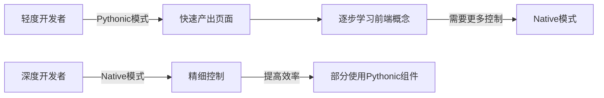
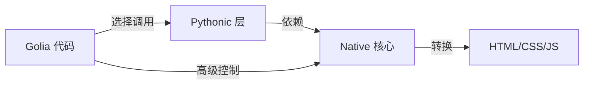

# Golia 代码生成器项目开发日志

---

- 2025.04.25 第一次记录

Golia 是昨天晚上临时立项的，属于是脑子一热就敲定的结果。

目前为止，Golia 已经实现了以下功能：

通过 com 容器承载页面，然后基于页面容器操作 HTML 元素。

设置元素时不必刻意担心格式问题，只需要依照 Python 的语法进行操作即可，HTML 格式由 Golia 自动控制。

对前端组件进行了简单的封装，如 Container.js.on_click 方法，用于声明一个点击事件。

这个项目的初衷就是简化前端开发，降低学习成本，这样后端人员就可以用更熟悉的语言进行开发，而不必额外学习一门前端语言。

然而当前的项目存在一个很大的痛点，就是开发者必须完整掌握了前端知识才能使用 Golia：

```python
com.body.h1 = "Hello World"
```

尽管有这样的简化语法，但是对于更复杂的一些情况：

```python
# 这些写法仍需要前端知识：
com.body.div(_class="container")  # 需要知道div/class的用途
com.css["a:hover"](color="red")  # 需要理解CSS选择器和伪类
```

这就导致了一个矛盾，Golia 本来是为了降低学习成本的手段，但是现在后端人员为了使用它，需要学习前端；

而前端人员为了使用 Golia 又要学一个后端去写本来已经很熟悉的前端，这是完全没必要的。

Golia 应该是一个无论对前端人员还是后端人员都有帮助的工具。

因此，关于 Golia 的下一步，我的想法是提供双模式支持：Pythonic 和 Native。

简单来说，Pythonic 是更接近 Python 风格的语法，这个主要是为后端人员设计的。

通过一些高级组件和特性，可以很容易地生成规范的前端代码。

而 Native 则是更接近原生前端的风格，这个主要是为前端人员设计的。

目前的 Golia 基本上处于 Native 阶段。

我应该采用自底向上的构建方法，将最基础的元素映射为 Native 层，然后在 Native 中提供一些辅助特性来帮助开发。

然后在 Native 层的基础上，构建抽象的 Pythonic 层，这个层应该提供一些高级特性，例如快速组件生成、模板等功能。

我和 AI 讨论了一下， 认为这种方向是可行的，最终我们将为不同程度的前端开发者提供两种模式，以适应不同的开发需求：



Pythonic 模式与 Native 模式是兼容的，并没有强制要求必须使用某一种模式。 根据实际开发过程中的需要，甚至可以混合使用。

这样，两种模式就不仅仅拘泥于形式，而是一套灵活的系统，允许开发者根据需要灵活地选择适合自己的模式。

例如，对于一些粗略的组件，可以使用 Pythonic 语法快速构建，然后对于需要精细调整的组件就使用 Native 语法来构建。

Golia 还可以利用 Python 的特性，例如将复用的控件组定义为函数，这样就可以在代码中复用它们，减少重复的代码。

从前端源码到 Native，再从 Native 到 Pythonic，这个过程是逐步向上的。不仅是因为当前 Golia 更偏向于 Native 模式，技术债务更低，而且 Native 与原生前端更接近，实现会相对容易。

另外，当 Native 足够完善后，Pythonic 也可以通过组合 Native 来实现一些新特性。



这就是目前的分层架构设想。

下一步的课题，就是如何实现这些想法，然后验证它们的实用价值。

---
